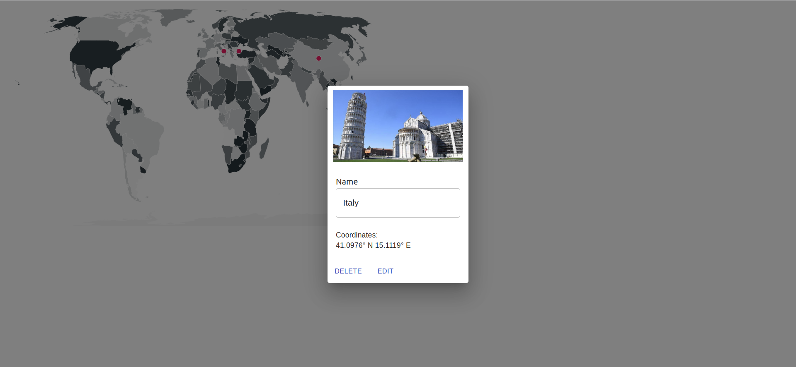

# World Map Marker Project

World Map Marker Project built with Django and React

 
## Usage
To build up all docker images: 

```bash
make build
```

After build process is completed, please visit: http://localhost:3000/

To stop all the running container processes:

```bash
make down
``` 

